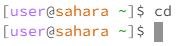
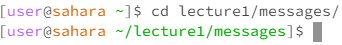
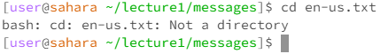
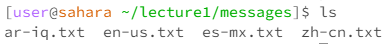
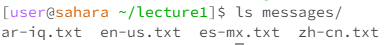
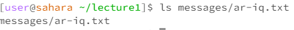
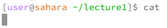
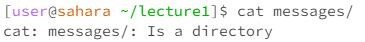
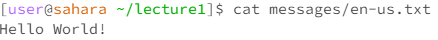

# **[Eric Wang: cse15l-lab-reports](https://github.com/erw004/cse15l-lab-reports)**
## **Lab Report 1**

This is cd by itself. It does not do anything because you I am not prompting the terminal to go into a directory. This is not an error.

This is cd with a directory as an argument. Here, cd changes the working directory to the argument, messages. This is not an error.

This is cd with a file as an argument. Since the argument is not a directory, the terminal prompts an error, saying that the argument is not a directory.

This is ls by itself. The working directory is the messages folder. Here, all the contents in the directory are listed on the terminal. This is not an error.

This is ls with a directory as an argument. The working directory is the lecture1 folder. Here, all the contents in the argument directory (messages) are listed on the terminal. This is not an error.

This is ls with a file as an argument. The argument is the ar-iq.txt file with the relative directory of messages/ar-iq.txt. As a result, that relative directory is listed out. This is not an error.

This is cat by itself. Since cat expects a file as an argument, the terminal just goes to the next line and waits for an argument. This is not an error.

This is cat with a directory as an argument. Since the argument is not a file, the terminal prompts an error, saying that the argument is a directory.

This is cat with a file as an argument. Since the argument is a file, the contents of the file is printed. So, the contents of en-us.txt is printed on the terminal as "Hello World!". This is not an error.

