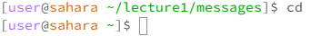

## **Lab Report 1**

### `cd`:

\
Working Directory: `/home/lecture1/messages`\
This is `cd` by itself. It changes the working directory to /home. This is not an error.

---
\
Working Directory: `/home`\
This is `cd` with a directory as an argument. Here, `cd` changes the working directory to the argument, `messages`. This is not an error.

---
\
Working Directory: `/home/lecture1/messages`\
This is `cd` with a file as an argument. Since the argument is not a directory, the terminal prompts an error, saying that the argument is not a directory.

### `ls`:

\
Working Directory: `/home/lecture1/messages`\
This is `ls` by itself. The working directory is the `messages` folder. Here, all the contents in the directory are listed on the terminal. This is not an error.

---
\
Working Directory: `/home/lecture1`\
This is `ls` with a directory as an argument. The working directory is the `lecture1` folder. Here, all the contents in the argument directory `messages` are listed on the terminal. This is not an error.

---
\
Working Directory: `/home/lecture1`\
This is `ls` with a file as an argument. The argument is the `ar-iq.txt` file with the relative directory of `messages/ar-iq.txt`. As a result, that relative directory is listed out. This is not an error.

### `cat`:

\
Working Directory: `/home/lecture1`\
This is `cat` by itself. Since `cat` expects a file as an argument, the terminal just goes to the next line and waits for an argument. 
If you enter `cat` again, `cat` is actually printed and the terminal goes to the next line and waits again. This is not an error.

---
\
Working Directory: `/home/lecture1`\
This is `cat` with a directory as an argument. Since the argument is not a file, the terminal prompts an error, saying that the argument is a directory.

---
\
Working Directory: `/home/lecture1`\
This is `cat` with a file as an argument. Since the argument is a file, the contents of the file is printed. So, the contents of `en-us.txt` is printed on the terminal as `Hello World!`. This is not an error.
