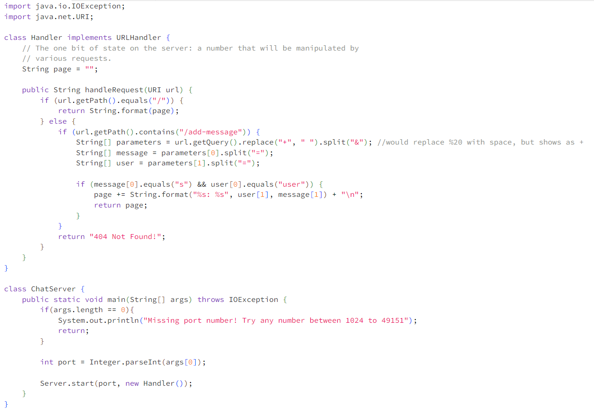

# **Lab Report 2**

## Part 1:

### Code:

### Two Screenshots:

The methods `main()` and `handleRequest()` are called. `main()` takes a `String` array `args` as an argument, which stores the port number. `handleRequest()` takes an argument `url`, which is the page's URL. The `Handler` class has the field variable `page`, which is a `String` that stores the messages that will be displayed on the page. From this request, the value of `page` gets changed from an empty string `""` to `"Eric: hi\n"` since we added a new message `Eric: hi` and `page` stores the messages.

Here, only `handleRequest()` is called since `main()` was already called to start the server. `handleRequest()` takes an argument `url`, which is the page's URL. The `Handler` class has the field variable `page`, which is a `String` that stores the messages that will be displayed on the page. From the last request, the value of  `page` is `"Eric: hi\n"` since that was our message. From this request, the value of `page` gets changed to `"Eric: hi\nEric Wang: Hello my friend!\n"` since we added a new message `Eric Wang: Hello my friend!`

## Part 2:
Absolute path to the private key for SSH key for logging into `ieng6`:\

Absolute path to the private key for SSH key for logging into `ieng6`:\

Logging into `ieng6` without password:\

## Part 3:
Prior to Lab 2 and Lab 3, I did not know what `ssh` was at all. Now, I know how to connect to the UCSD CS server with my own laptop as the client. Additionally, I didn't know how to write a web server. Now, I know how to write one and handle incoming requests.
