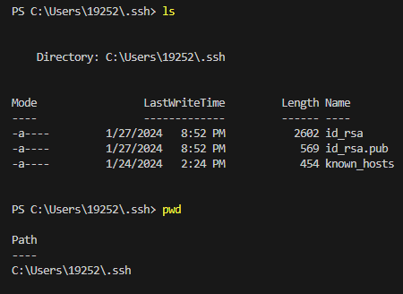
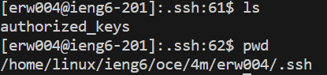

# **Lab Report 2**

## Part 1:

### Code:
```
import java.io.IOException;
import java.net.URI;

class Handler implements URLHandler {
    // The one bit of state on the server: a number that will be manipulated by
    // various requests.
    String page = "No messages yet.";

    public String handleRequest(URI url) {
        if (url.getPath().equals("/")) {
            return String.format(page);
        } else {
            if (url.getPath().contains("/add-message")) {
                String[] parameters = url.getQuery().replace("+", " ").split("&"); //would replace %20 with space, but shows as +
                String[] message = parameters[0].split("=");
                String[] user = parameters[1].split("=");

                if (page.equals("No messages yet.")) page = "";

                if (message[0].equals("s") && user[0].equals("user")) {
                    page += String.format("%s: %s", user[1], message[1]) + "\n";
                    return page;
                }
            }
            return "404 Not Found!";
        }
    }
}

class ChatServer {
    public static void main(String[] args) throws IOException {
        if(args.length == 0){
            System.out.println("Missing port number! Try any number between 1024 to 49151");
            return;
        }

        int port = Integer.parseInt(args[0]);

        Server.start(port, new Handler());
    }
}
```

### Two Screenshots:

`handleRequest()` is called. `handleRequest()` takes an argument `url`, which is the page's URL. The `Handler` class has the field variable `page`, which is a `String` that stores the messages that will be displayed on the page. There are also local variables `parameters`, `message`, and `user` in `handleRequest()`, which are all `String[]` that store different tokens from the query part of the URL.

From this request, the value of `page` gets changed from `"No messages yet."` to an empty string `""` to `"Eric: hi\n"` since we added a new message `Eric: hi`.


`handleRequest()` is called. `handleRequest()` takes an argument `url`, which is the page's URL. The `Handler` class has the field variable `page`, which is a `String` that stores the messages that will be displayed on the page. There are also local variables `parameters`, `message`, and `user` in `handleRequest()`, which are all `String[]` that store different tokens from the query part of the URL.

From the last request, the value of  `page` is `"Eric: hi\n"` since that was our message. From this request, the value of `page` gets changed to `"Eric: hi\nEric Wang: Hello my friend!\n"` since we added a new message `Eric Wang: Hello my friend!`


## Part 2:
\
Absolute path to the private key: `/Users/19252/.ssh/id_rsa`

---

\
Absolute path to the public key:`/home/linux/ieng6/oce/4m/erw004/.ssh`

---

\
Logging into `ieng6` without password


## Part 3:
Prior to Lab 2 and Lab 3, I did not know what SSH was at all. Now, I know how to connect to the UCSD CS server with my own laptop as the client. Additionally, I didn't know how to write a web server. Now, I know how to write one and handle incoming requests.
