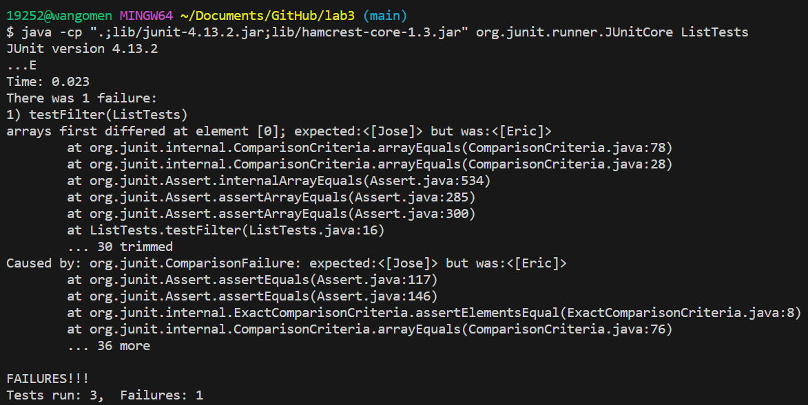

## Part 1 - Bugs

### ListExamples.java filter() bug
Failure Inducing Input:
```
@Test 
	public void testFilter() {
        List<String> input = new ArrayList<>();
        input.add("Eric");
        input.add("Jose");
        input.add("Brandon");
        List<String> result = new ArrayList<>();
        result.add("Eric");
        result.add("Jose");
        assertArrayEquals(ListExamples.filter(input, new ListExamples()).toArray(), result.toArray());
	}
```

Input that does not induce failure:
```
@Test
    public void testFilter2() {
        List<String> input = new ArrayList<>();
        input.add("Eric");
        List<String> result = new ArrayList<>();
        result.add("Eric");
        assertArrayEquals(ListExamples.filter(input, new ListExamples()).toArray(), result.toArray());
    }
```

The symptom:


The bug:

Before:
```
static List<String> filter(List<String> list, StringChecker sc) {
    List<String> result = new ArrayList<>();
    for(String s: list) {
      if(sc.checkString(s)) {
        result.add(0, s); //the bug before
      }
    }
    return result;
}
```

After:
```
static List<String> filter(List<String> list, StringChecker sc) {
    List<String> result = new ArrayList<>();
    for(String s: list) {
      if(sc.checkString(s)) {
        result.add(s); //the bug fixed
      }
    }
    return result;
}
```
