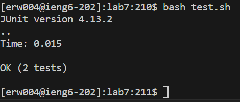

# Lab Report 4 - Vim (Week 7)
---

## Step 4:
Keys Pressed: `<up><enter>` The `ssh erw004@ieng6.ucsd.edu` command, which lets me log into `ieng6`, was 1 up in the search history, so I used the up arrow once to access it and then pressed the enter key to run it.

## Step 5:
Keys Pressed: `<ctrl><r><g><enter>` I used `<ctrl><r><g>` to access the command `git clone git@github.com:erw004/lab7.git`, which clones my fork using the `SSH` URL, since it includes the letter g. Then, I ran the command by pressing the enter key.

## Step 6:
Keys Pressed: `<c><d><space><l><tab><enter>` The `cd lab7` command lets me enter the `lab7` directory, where I can run the tests.

Keys Pressed: `<b><a><s><h><space><t><e><s><t><.><s><h><enter>` I simply typed the command `bash test.sh` and pressed the enter key to run the tests, which failed.

## Step 7:
Keys Pressed: `<up><up><up><up><enter><r><2><esc><:><w><q><enter>` The `vim ListExamples.java` command was 4th in the search history, so I pressed the up arrow 4 times to access it and pressed the enter key to run it. Now, I can edit `ListExamples.java`. Since I was already at the right spot to edit the bug, I pressed the r key and the 2 key to change the 1 of `index1` into a 2 to become `index2`, fixing the bug.

## Step 8:
Keys Pressed: `<up><up><enter>` I accessed the command `bash test.sh` since it was 2nd on the search history and pressed the enter key to run the tests, which passed this time.

## Step 9:
Keys Pressed: `<g><i><t><space><a><d><d><space><L><tab><.><j><a><v><a><enter>` I typed out the command `git add ListExamples.java` and pressed enter so that I can add the changes I did in `vim`. I needed to add the `.java` extension because pressing tab did not provide me the extension.

---
Keys Pressed: `<g><i><t><space><c><o><m><m><i><t><space><-><m><space><"><d><o><n><e><"><enter>` I typed out the command `git commit -m "done"` and pressed the enter key so that I can commit and save the changes locally with a commit message of `done`.

---
Keys Pressed: `<g><i><t><space>
<u><s><h><enter>` I typed out the command `git push` and pressed the enter key so I can push these changes to GitHub.

