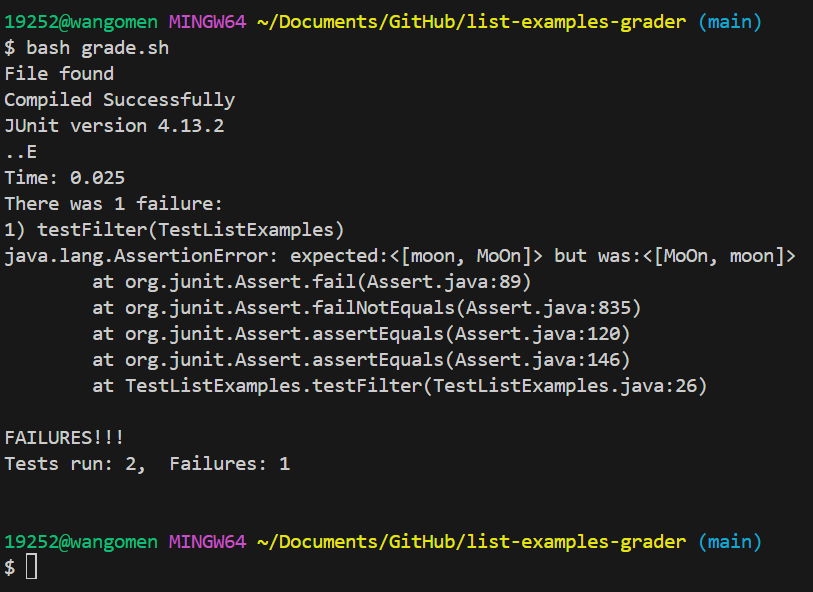
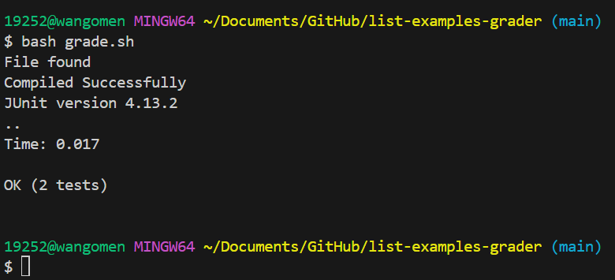

## Lab Report 5
---

**Student:** Hi, I was working on `filter()` from `ListExamples.java` and I'm unsure on why I'm not passing my tests. I'm totally stuck and don't know where to start. I have provided a screenshot of the symptom below.

**TA:** Hey, according to your screenshot, the expected output should be `[moon, MoOn]` and the actual output was `[MoOn, moon]`. So, can you describe to me why the expected output is the way it is?

**Student:** Well, the algorithm is supposed to return a list that only has elements which return true for `StringChecker`. In my case, for `StringChecker`, I'm checking whether the string is the word moon. But why is my output wrong if all the elements in the list are moon.

**TA:** Yes, it seems like all the elements in the list are moon. One step in the right direction is to think about the order of the elements inside the list.

**Student:** Oh, I think I see the bug. 

I think that I am adding all the elements to the front of the list with the line `result.add(0, s);`. The algorithm is supposed to return the new list in the same order as the input. I just changed the line to `result.add(s);` so the elements are added in the correct order and my tests work. Thank you.

**TA:** Great work!

---

**Reflection**: In the second half of this quarter, I didn't know how to use `vim` nor `jdb` at all. Now, I can proficiently use `vim` to edit files while maintaining a minimum amount of keystrokes and use `jdb` to effectively debug my code.
